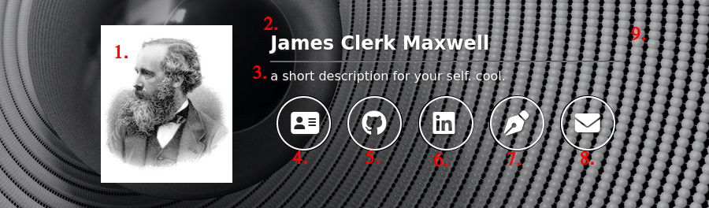

# Template for a simple personal website

## How to use
1. Clone this repo
1. Modify the desired values
1. Push changes to your cloned repo
1. Deploy this as your github-page
1. Profit

## Customisable values

### Header
Values displayed in the header section are basically extracted from `_config.yml`.



1. Profile picture: Update `profile-photo`. Absolute paths and relative paths, e.g., `assets/img/photo.png`, should both work.
2. Name: Update `name`. This name is also displayed in the footer.
3. Short description: Update `description`. Technically speaking, it does not need to be short, but this is supposed to be a headline and the longer content is left in the `about` section below.
4. Link to resume: Update `resume`. Absolute paths and relative paths, e.g., `./resume.pdf`, should both work.
5. Link to GitHub profile: Update `github_username`. Put only your username.
6. Link to LinkedIn profile: Update `linkedin_username`. The value should be the last part of your LinkedIn URL, i.e., `https://linkedin.com/in/<your name here>`.
7. Link to blog: Update `blog`. Absolute paths and relative paths, e.g., `/blog`, should both work, though relative paths need to be handled with extra care since this template does not include a blog.
8. Link to email address: Update `email`.
9. Background image: Update `background-img`. Absolute paths and relative paths, e.g., `assets/img/photo.png`, should both work.

### About me

The content in this section is extracted from a markdown file `about.md`. Just put whatever you want in that file.

### Timeline

The items are rendered based on `_data/experiences.yml`. In this file is a list of experiences with attributes as follows:
* `company`: Info about the company/institute/whatever. It has the following attributes:
	* `name`: Name of the company.
	* `link`: Link to the company. Optional.
	* `logo`: Logo of the company. Optional.
* `title`: Your title (or whatever you want to write) when in that company.
* `start`: Start date. It needs to be in the format `YYYY-MM-DD`. `DD` doesn't matter. This field is used to sort the experiences.
* `end`: End date. It needs to be in the format `YYYY-MM-DD`. `DD` doesn't matter. Can be Something else like `Present` as well.

A sample experience may look like:
```yaml
- company:
    name: Google
    link: https://google.com/
    logo: assets/img/google.svg
  title: Software engineer
  start: 2019-07-01
  end: 2021-01-01
```
